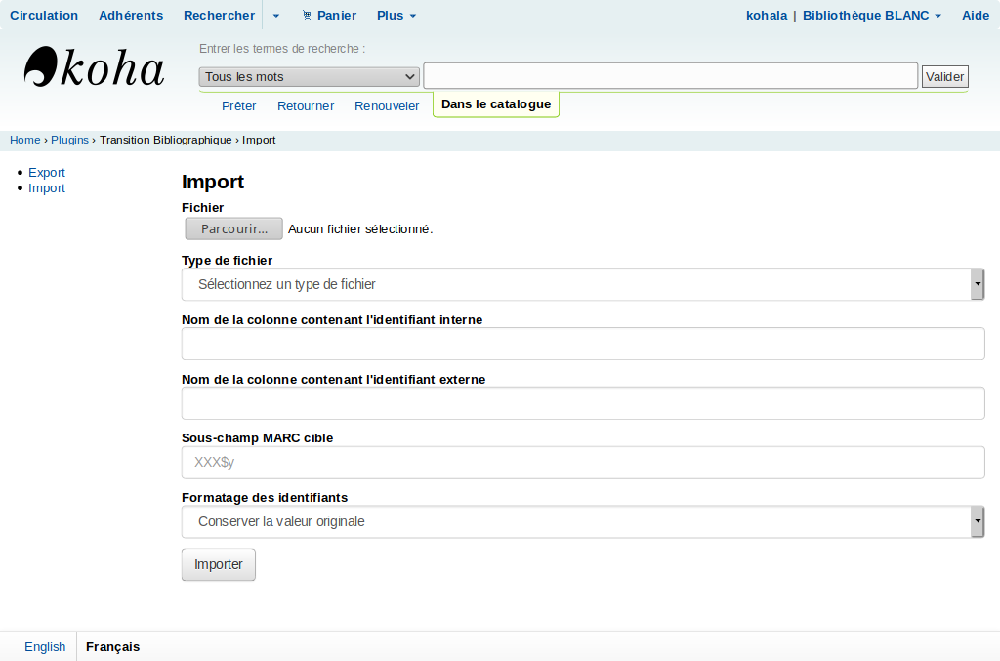

# Plugin Transition Bibliographique pour Koha

Ce plugin vise à faciliter l'import de données dans Koha pour la
transition bibliographique

# Documentation fonctionnelle

[Index de la documentation fonctionnelle](doc/)




# Pré-requis

- Koha 18.11 minimum
- Modules Perl:
  - YAML

# Installation

## Plugin Koha

1. Récupérer [la dernière version du
   plugin](https://github.com/biblibre/koha-plugin-transition-bibliographique/releases/latest)
   (fichier .kpz) ou cloner le dépot du plugin
2. Installer le plugin via l'interface d'administration de Koha (syspref et koha-conf.xml)
3. Sur le serveur, copier
   `Koha/Plugin/Com/BibLibre/TransitionBibliographique/config.yaml.sample`
   vers `Koha/Plugin/Com/BibLibre/TransitionBibliographique/config.yaml`
4. Si besoin, modifier `config.yaml`
5. Mettre
   `Koha/Plugin/Com/BibLibre/TransitionBibliographique/cron/job-runner.pl`
   en cronjob.
6. (Optionnel) Mettre
   `Koha/Plugin/Com/BibLibre/TransitionBibliographique/cron/purge.pl` en
   cronjob

## Audit v1

1. idem que pour le plugin Koha
2. Lancer `Koha/Plugin/Com/BibLibre/TransitionBibliographique/scripts/setup-audit-tbiblio.sh` pour créer la table des métriques
3. Mettre
   `Koha/Plugin/Com/BibLibre/TransitionBibliographique/cron/audit-tbiblio.pl`
   en cronjob (ou le lancer manuellement)

# Cronjobs

Tous les cronjobs doivent être lancés quotidiennement, de préférence la nuit
pour ne pas gêner l'utilisation normale de Koha.

Exemple:

```
PERL5LIB=/path/to/koha
KOHA_CONF=/path/to/koha-conf.xml
PATH_TO_PLUGIN=/path/to/plugin

50 22 * * * $PATH_TO_PLUGIN/Koha/Plugin/Com/BibLibre/TransitionBibliographique/cron/purge.pl --older-than=30
0 23 * * * $PATH_TO_PLUGIN/Koha/Plugin/Com/BibLibre/TransitionBibliographique/cron/job-runner.pl
3 22 * * * $PATH_TO_PLUGIN/Koha/Plugin/Com/BibLibre/TransitionBibliographique/cron/audit-tbiblio.pl
```
