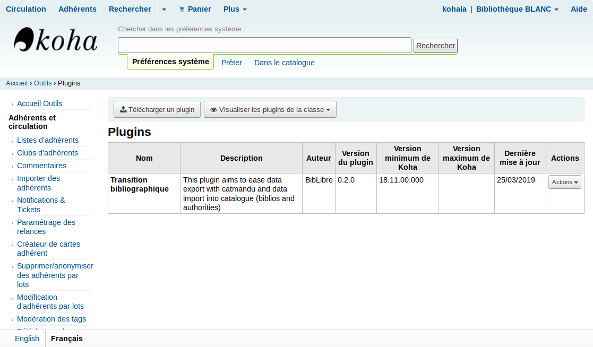

# Plugin Koha "Transition bibliographique"

Le plugin Koha "Transition bibliographique" est un module optionnel qui peut être ajouté à Koha afin de faciliter l'alignement du catalogue Koha avec les réservoirs nationaux. Une fois les identifiants intégrés comme les clés ARK, les outils de type moissonneur (comme le vendangeur) pourront mettre à jour les notices en se basant sur ces clés.

Il est principalement dédié à la communauté francophone Unimarc afin de simplifier au maximum le processus d'extraction et d'importation avec Koha. L'export des données peut se faire aujourd'hui avec un profil CSV et rapports SQL. L'export peut aussi être réalisé avec un rapport SQL pour récupérer les biblionumber que vous souhaitez puis utiliser le module d'export de Koha en utilisant la liste des biblionumber ainsi obtenue.Vous pouvez lire la [page sur les alternatives](alternatives.md). Nous avons souhaité rendre ce processus d'extraction plus souple et extensible.

Bibliostratus est identifié dans la transition bibliographique comme étant le logiciel libre de référence pour permettre d'aligner les catalogues avec la BnF. Vous pouvez utiliser ce plugin dans le but de traiter votre catalogue avec Bibliostratus.

Il serait possible de travailler uniquement avec le vendangeur développé par BibLibre, cependant le processus et les résultats ne sont pas les mêmes. Une fois les données dans Koha, il sera temps de mettre en valeur ces données liées dans le catalogue. L'idée est de rendre autonome un maximum les utilisateurs Koha intéressés notamment par Bibliostratus.

Ce plugin est découpé en deux parties:
* [Export des données du catalogue](export.md) avec des règles spécifiques Catmandu
* [Import des identifiants](import.md) dans votre catalogue Koha

Ce plugin a été initiallement commandé par l'association [Kohala](http://koha-fr.org/) et développé par [BibLibre](http://biblibre.com/). Il est sous [licence libre](../LICENSE).

Pour accéder au plugin, rendez vous sur: Outils > Outil de Plugins >  Bouton "Lancer l'outil" (du dit plugin)
