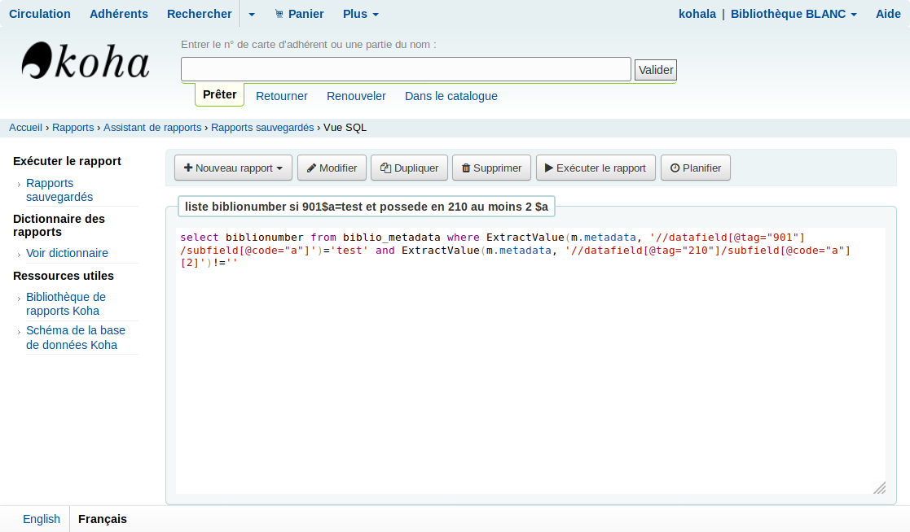
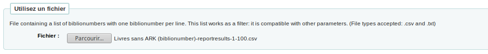
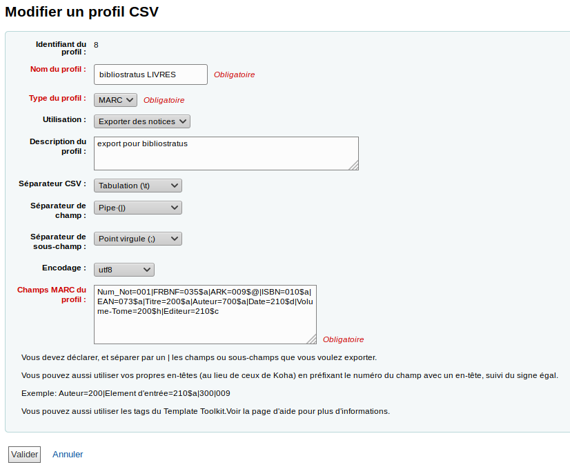

## Alternatives

### Rapport SQL puis Outil d'Export

Sortir avec l'outil de rapport une liste de biblionumber qui répond à certains critères:
```
# Exemple: liste biblionumber si 901$a=test et possede en 210 au moins 2 $a
select biblionumber from biblio_metadata where ExtractValue(m.metadata, '//datafield[@tag="901"]/subfield[@code="a"]')='test' and ExtractValue(m.metadata, '//datafield[@tag="210"]/subfield[@code="a"][2]')!=''
```


Injecter la liste de biblionumber ainsi obtenue dans l'outil d'export pour récupérer un fichier MARC.



### Profils CSV

Utiliser les profils CSV pour extraire de votre catalogue exactement les données que vous souhaitez analyser avec Bibliostratus.


