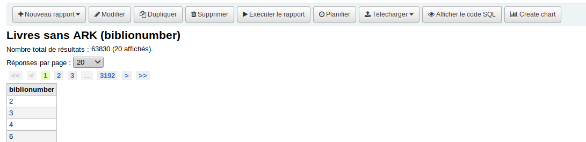
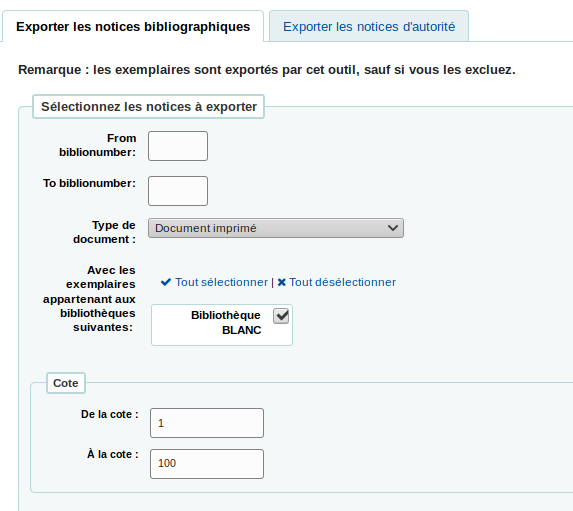
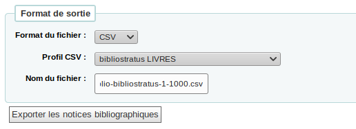

## Alternatives d'export de données

Décrit les possibilités pour extraire de Koha des données afin de les faire passer ensuite directement dans Bibliostratus avec les outils déjà existant dans Koha.

### Rapport SQL

Sortir avec l'outil de rapport une liste de biblionumber qui répond à certains critères:

```sql
# Exemple: liste biblionumber si 901$a=test et possede en 210 au moins 2 $a
select biblionumber 
from biblio_metadata 
where ExtractValue(m.metadata, '//datafield[@tag="901"]/subfield[@code="a"]')='test' 
and ExtractValue(m.metadata, '//datafield[@tag="210"]/subfield[@code="a"][2]')!=''
```

```sql
# Biblionumber des notices de type Livre
select bm.biblionumber   
from biblioitems bi, authorised_values a , biblio_metadata bm   
where a.category='TYPE_DOC'    
  and bi.biblionumber = bm.biblionumber   
  and a.authorised_value=bi.itemtype    
  and a.lib = "Livre"
```
Cette requête est à adapter en fonction de votre catalogue et vos besoins. Vous choisissez ainsi la partie du catalogue que vous souhaitez enrichir, pas à pas.


Télécharger la liste des biblionumber ainsi obtenue.



Dans Koha: Rapports => `koha/reports/reports-home.pl`

###  Outil d'Export

Injecter la liste de biblionumber dans l'outil d'export pour récupérer un fichier MARC.


Ou exporter les notices bibliographiques ou d'autorité avec les options proposées par l'outil dans Koha.



Choisir le profil CSV précédemment créé.




Dans Koha: Outils > Exporter les données => `koha/tools/export.pl`

### Profils CSV

Utiliser les profils CSV pour extraire de votre catalogue exactement les données que vous souhaitez analyser avec Bibliostratus.


Si vous souhaitez utiliser le fichier en sortie avec Bibliostratus, vous devez adapter le format [en fonction des colonnes qu'il attend](https://github.com/Transition-bibliographique/bibliostratus/tree/master/doc) et le séparateur doit être une tabulation.

Dans Koha: Outils > Profils CSV => `koha/tools/csv-profiles.pl`


