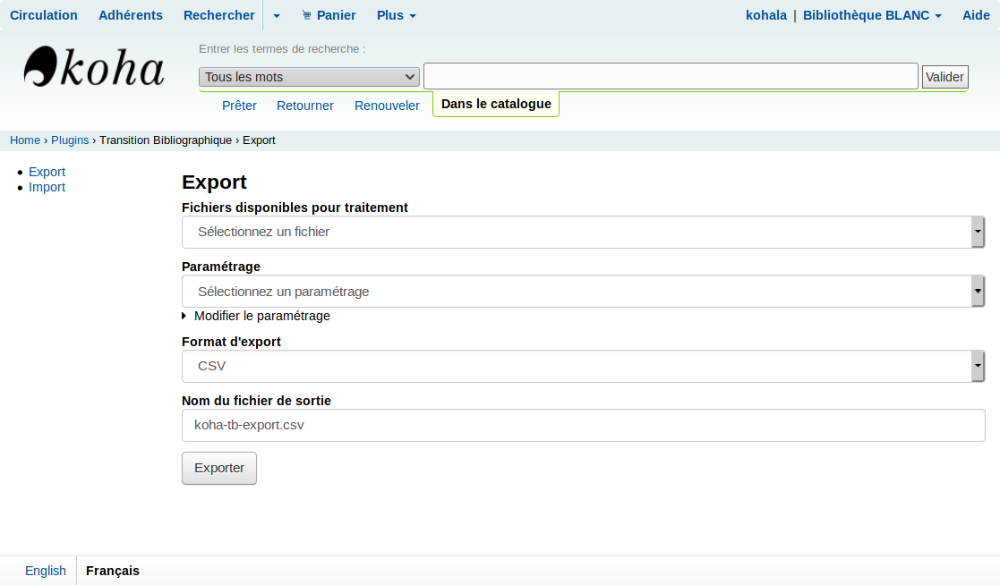

## Export des données du catalogue

### Fichiers disponibles pour traitement

* Catalogue complet autorités
* Catalogue complet biblios avec exemplaires
* Catalogue complet biblios
* Jeu de test (10000 autorités)
* Jeu de test (10000 biblios avec exemplaires)

Les exports sont réalisés par une tache périodique sur le serveur, ainsi à tout moment (et si la tâche est correctement programmée), vous disposez de données de votre catalogue à jour.

Nous vous invitons à lancer les traitements avant tout sur les Jeux de test. Il seront plus rapides à être exécutés et vous pourrez rapidement savoir si c'est le résultat que vous attendez.

### Paramétrage

Par défaut, des règles d'export sont proposées. Vous pouvez les modifier en cliquant sur "Modifier le paramétrage". Les règles proposées sont appelées des ["fix Catmandu"](http://librecat.org/Catmandu/#fixes-cheat-sheet) et respectent une syntaxe particulière. Ils permettent de réaliser un filtrage de vos notices beaucoup plus fin que ceux proposés.

Fix souhaités initialement :
* Ne contenant pas d'ARK en 033$a
* Ne contenant pas de PPN en 009
* Par type de document (par exemple: 319, 039, 995rou200b)
* Par côte
* Modifié entre A et B
* Du biblionumber A à B (le moins pertinent)Un exemple avec plusieurs conditions enchaînée

Le traitement se base sur les données contenues dans le catalogue et pas spécifiquement sur les colonnes du SIGB. Ainsi si les données ne sont pas dans vos grilles de catalogage vous ne pourrez pas filtrer sur celles ci.

Vous trouverez dans chaque "fix" sa documentation dans le "fichier associé"":https://github.com/biblibre/koha-plugin-transition-bibliographique/tree/master/Koha/Plugin/Com/BibLibre/TransitionBibliographique/fixes. Vous pouvez contribuer de nouvelles règles par les processus habituels de Github.

Le processus est lancé à la volée. Pour les plus gros catalogues, il faudra peut être envisager une mise en background de la tache. Cette option n'est pas incluse dans la version 0.0.2.

## Format

Vous pouvez télécharger les formats suivants:
* CSV
* TSV
* MARC
* JSON

Selon ce que vous voulez faire, vous devrez adapter les traitements.

##  Nom du fichier de sortie

Par défaut il prend l'extension du format choisi. Vous pouvez modifier le nom complet du fichier exporté.
