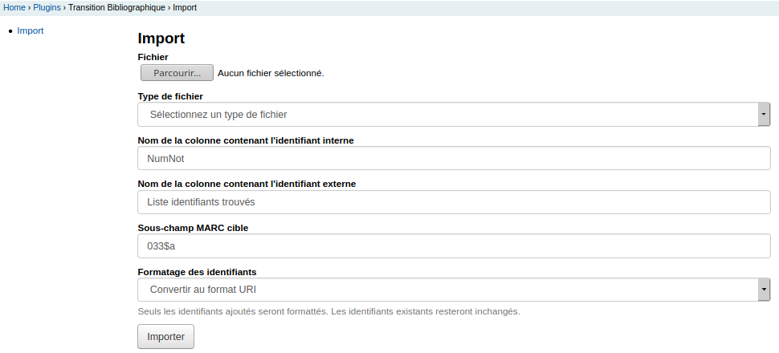

# Import des identifiants dans votre catalogue

Avant le développement de ce plugin, une fois la liste d'identifiants obtenue et validée par le
bibliothécaire, il n'était pas possible de simplement intégrer ces identifiants dans
Koha. C'est maintenant possible grace à la fonctionnalité décrite ci-dessous:



## Formulaire d'import

Cet outil propose à l'utilisateur de :
* Télécharger sur le serveur des fichiers CSV contenant les
biblionumber dans une colonne et l'identifiant à intégrer dans une autre. Vous pouvez également mettre dans "Fichier" un fichier sortant du module d'alignement de Bibliostratus
* Sélectionner le "type de fichier": est ce un fichier avec des autorités ou des notices bibliographiques
* Indiquer le nom de la colonne contenant les biblionumber (identifiant interne de Koha)
* Indiquer le nom de la colonne source contenant l'identifiant à ajouter à votrecatalogue (identifiant externe)
* Indiquer le champ Unimarc cible où l'identifiant externe sera injecté

## Exemple

Dans votre catalogue:
```
001     2
035 $a
```
Dans notre exemple
* le champ 033$a n'existe pas.
* lechamps 035$a est vide

Le fichier que nous demandons à importer est:

```
NumNot  Nb identifiants trouvés Liste identifiants trouvés      Méthode d'alignement    FRBNF   ARK     ISBN    EAN     Titre   Auteur  Date   Volume-Tome      Editeur
2       1       ark:/12148/cb410407518  ISBN | Problèmes dans métadonnées Titre-Auteur-Date-Volume                      978-2-215-08720-5      Saisons  Les     redoula"s emilie sta(c)phanie ferrier catherine beaumont        2011            Fleurus
```

C'est un fichier de sortie du module d'alignement de Bibliostratus (version avril 2019) qui a trouvé pour "NumNot" = 2, un ARK=ark:/12148/cb410407518. Les données des autres colonnes sont informatives. On souhaite mettre cet ARK dans notre catalogue Koha pour la notice ayant pour biblionumber 2.

Nous remplissons le formulaire suivant:
* Fichier: sélectionner le fichier .txt (ou .csv) sur le disque dur
* Nom de la colonne contenant l'identifiant interne = NumNot
* Nom de la colonne contenant l'identifiant interne = Liste identifiants trouvés
* Sous-champs MARC cible = 035$a
* Formatage des identifiants = Conserver la valeur originale

## Règles du script

* Vérification de la cohérence des champs de la grille de catalogage mentionnés
  * Le champ MARC (00X ou XXX$y) doit exister dans la grille de catalogage par défaut

* Mise à jour des notices avec la colonne source
  * Les imports sont lancés en tache de fond
  * Vous visualiserez leur avancement ainsi que les logs applicatifs après lancement dans le tableau en dessous du formulaire


* Si l'identifiant est déjà présent, il ne l'ajoute pas
<pre>
[2019-04-23 11:51:45] Identifiant déjà présent pour la notice 2 (ligne 2)
[2019-04-23 11:51:45] Résumé:
[2019-04-23 11:51:45]     Notices traitées: 1
[2019-04-23 11:51:45]     Notices mises à jour: 0
[2019-04-23 11:51:45]     Notices non mises à jour: 1
[2019-04-23 11:51:45]     Notices avec identifiant déjà présent: 1
[2019-04-23 11:51:45]     Notices non trouvées: 0
</pre>

* Si l'identifiant n'est pas de la forme attendue, il ne l'ajoute pas
<pre>
[2019-04-23 12:06:55] Impossible de formatter l'identifiant, format non reconnu : PPN12345678
</pre>

## Options de l'import

### Conserver la valeur originale

* Comme son nom l'indique, le script prend la valeur présente dans la colonne fournie sans traitement et l'importe

### Nettoyer

* Retire la partie "URL" si elle existe
* Retire le prefixe "PPN" : "PPN123456789" devient 123456789

### Convertir au format URI

* Ajoute  https://catalogue.bnf.fr/ devant ark:/12148/xy***********
* Transforme  PPN*********  en http://www.sudoc.fr/********* si c'est une notice bibliographique et http://www.idref.fr/***
* Si le catalogue contient déjà les identifiants avec ou sans URI, les champs ne seront pas remplacés. Vous pouvez passer par les modifications par lot si vous souhaitez changer de format. L'identifiant est considéré comme déjà présent. Ce sont les valeurs "sans URI" qui sont comparées pour déclancher cette règle.

### Autres règles

* S'il y a plus d'un ARK ou PPN dans le fichier d'import pour une notice, alors il y a une erreur 
  * "Plusieurs identifiants ARK pour la notice"
* Il est possible d'importer pour une notice un ARK et un PPN 
  * "Identifiant ajouté pour la notice"
* Si un ARK est déjà présent dans la notice et qui n'est pas le même que celui que j'importe du fichier, alors une erreur est levée (pareil pour le cas d'un PPN)
  * "Un identifiant *** différent est déjà présent dans la notice"
* Si une forme de l'identifiant est déjà présente dans la notice, l'identifiant n'est pas ajouté et l'import est considéré comme un succès
  * "Identifiant déjà présent pour la notice"
* Si le champ est répétable, alors un nouveau champ MARC est créé pour ajouter l'identifiant
* Si le champ n'est pas répétable et qu'il existe dans la notice, le champ existant est conservé et l'identifiant n'est pas ajouté

Après l'exécution du script, l'utilisateur pourra voir les logs de chaque traitement exécuté :
* Visualiser le nombre de notices mises à jour avec succès
* Les identifiants des notices qui n'ont pas pu être mises à jour (non
trouvées)
* Le nombre de notices mises à jour
* Le nombre de notices avec identifiant déjà présent

## Fonctionnements

* Le séparateur du fichier est auto déterminé. Le script cherche quel est le séparateur, ainsi l'utilisateur n'a pas à s'en préoccuper. Séparateurs autorisés: "," ";" ":" "|" "<TAB>" " " 

## Points de vigilance

* Avant de télécharger le fichier CSV sur le serveur, pensez à bien choisir le format des identifiants que vous allez importer: avec URI ou sans

* Avant de télécharger le fichier csv sur le serveur, pensez à vérifier le nom des colonnes et le format de ce dernier

OK
```
NumNot,Nb,identifiants,trouvés,Liste,identifiants,trouvés,Méthode,d'alignement,FRBNF,ARK,ISBN,EAN,Titre,Auteur,Date,Volume-Tome,Editeur,,,,,,,,
2,1,PPN186264577,ISBN,|,Problèmes,dans,métadonnées,Titre-Auteur-Date-Volume,,,978-2-215-08720-5,,Saisons,,Les,,emilie,catherine,"redoula""s",ferrier,beaumont,sta(c)phanie,2011,,Fleurus
```
OK
```
biblionumber, ppn
3, PPN186264577
10,http://www.sudoc.fr/157396568
```

KO => les valeurs ne sont pas bonnes
```
_id,record
1,ARRAY(0xcbb9300)
2,ARRAY(0xca27198)
3,ARRAY(0xe8188a8)
```

KO => ce n'est pas un fichier CSV
```
<?xml version="1.0" encoding="UTF-8"?>
<collection
  xmlns:xsi="http://www.w3.org/2001/XMLSchema-instance"
  xsi:schemaLocation="http://www.loc.gov/MARC21/slim http://www.loc.gov/standards/marcxml/schema/MARC21slim.xsd"
```
